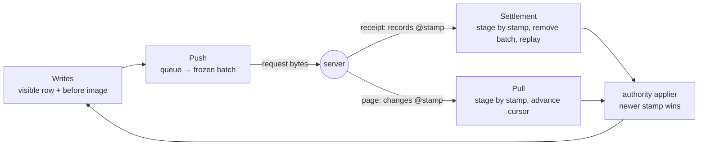

# Engine

The engine is the client's sync logic. It has no memory between calls: every operation runs in a store transaction and leaves its state in tables.

- [Local operations](local-operations/README.md) — Local reads, writes and transactions.
  - [Writes](local-operations/writes.md) — Apply mutations and direct writes optimistically over a before image.
  - [Queries](local-operations/queries.md) — Read by identity, filter, order, relation and read-only SQL.
- [Push](push/README.md) — Queue mutations, track dependencies and freeze batches.
  - [Queue](push/queue.md) — Persist mutations, operations and their ordering.
  - [Dependencies](push/dependencies.md) — Decide which mutations are eligible to send.
  - [Batching](push/batching.md) — Freeze eligible mutations and preserve their bytes for retries.
- [Pull](pull.md) — Apply server changes and advance cursors.
- [Settlement](settlement.md) — Complete a batch from its receipt: stage the returned authority by stamp, roll back rejections and replay pending changes.

## How the parts work together

A receipt and a page for the same change carry the same stamp; whichever arrives second rewrites nothing.

One local edit passes through all four:

1. **Write.** [Local operations](local-operations/README.md) applies the edit to the visible table, keeps the server's last row in a before image, and stores the mutation in the queue.
2. **Push.** [Push](push/README.md) decides when the mutation may be sent, freezes it with others into a numbered batch, and hands the bytes to the connection.
3. **Settlement.** The server answers with a receipt that carries the final content and stamp of every record the batch changed. [Settlement](settlement.md) completes the batch from that receipt alone, in one transaction: the authority is staged beneath the pending operations by stamp, the completed mutation is removed, and the row is rebuilt so the visible row is the server's row with only the newer pending edits, if any, on top. A rejection instead removes the mutation and rebuilds the row from the before image without it. No channel is awaited.
4. **Pull.** If the handler also published the record, a page covering every followed channel arrives, later or earlier; [Pull](pull.md) applies it as one transaction through the same authority applier and moves each channel's cursor to the page's end, reporting anything it could not apply. The page carries the same stamp as the receipt, so whichever arrives second rewrites nothing. While the record is still dirty, a page's newer row becomes the new before image and the visible row is rebuilt at once: before image plus the pending edits replayed on top.

Two counters keep this honest and never mix: the channel cursor orders pages within a subscription; the record stamp orders content across every path that delivers it, receipt or page. Both are explained in [Pull](pull.md).

## Code map

| Part | Code location |
|---|---|
| Local operations / Writes | [client/mutate.rs](../../../../../crates/client/src/mutate.rs), [client/rows.rs](../../../../../crates/client/src/rows.rs) |
| Local operations / Queries | [client/query.rs](../../../../../crates/client/src/query.rs) |
| Push / Queue | [client/queue.rs](../../../../../crates/client/src/queue.rs), [client/ddl.rs](../../../../../crates/client/src/ddl.rs) |
| Push / Dependencies | [client/policies.rs](../../../../../crates/client/src/policies.rs), [client/queue.rs](../../../../../crates/client/src/queue.rs); eligibility checks in [client/push.rs](../../../../../crates/client/src/push.rs) |
| Push / Batching | [client/push.rs](../../../../../crates/client/src/push.rs); push assignment in [client/queue.rs](../../../../../crates/client/src/queue.rs) |
| Pull | [client/downlink.rs](../../../../../crates/client/src/downlink.rs), [client/ledger.rs](../../../../../crates/client/src/ledger.rs); the authority applier in [client/authority.rs](../../../../../crates/client/src/authority.rs); incoming-page dispositions in [client/transport.rs](../../../../../crates/client/src/transport.rs) (`receive_downlink`) |
| Settlement | [client/push.rs](../../../../../crates/client/src/push.rs) (`acknowledge`, `mark_rejected`); the authority applier in [client/authority.rs](../../../../../crates/client/src/authority.rs) (`stage_authority`, `rebuild_held`); replay in [client/mutate.rs](../../../../../crates/client/src/mutate.rs) (`rebuild`) |
